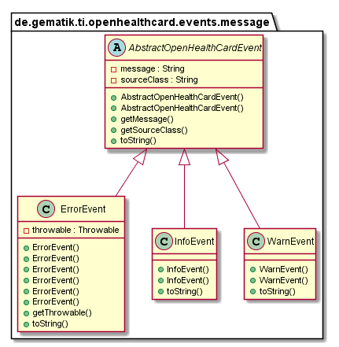
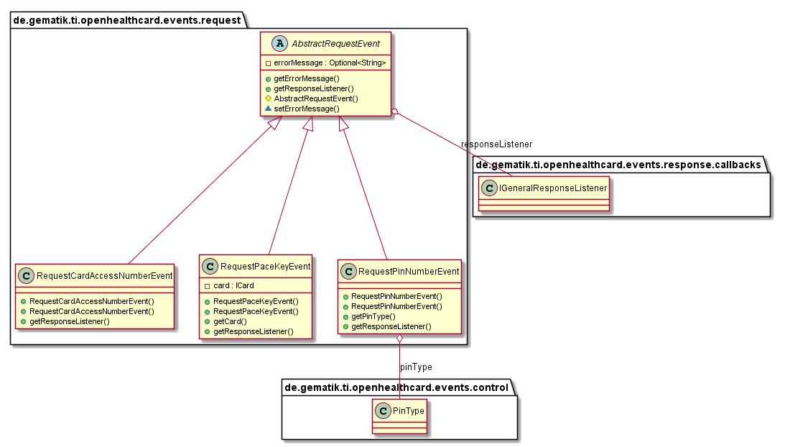
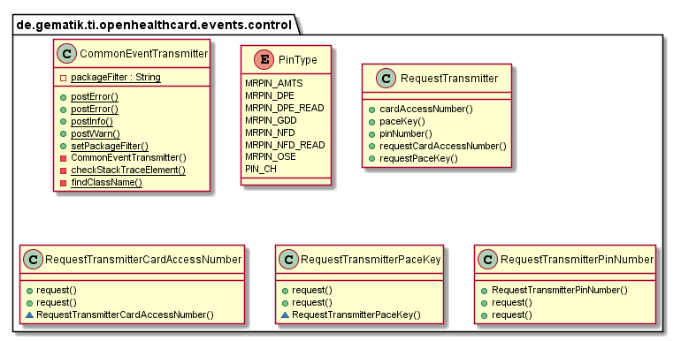

# OpenHealthCard-Events

## Introduction

This part describes the OpenHealthCard-Events functionalities and structure.

## API Documentation

Generated API docs are available at <https://gematik.github.io/ref-OpenHealthCard-Events>.

## License

Licensed under the [Apache License, Version 2.0](https://www.apache.org/licenses/LICENSE-2.0).

## Overview

This library contains overarching events for several layers.
That includes general events for info, warn and error

  

Additionally request events to get asynchronous input from user application

  

For easy use could you use the controller instances to send events to EventBus.

  

### EventTransmitter

For easy use could you use the controller instances to send events to EventBus.
This Controller Instances are `CommonEventTransmitter` to send information,
`RequestTransmitter` to generate the context specific Transmitter like PaceKey, PinNumber, etc.

  

#### CommonEventTransmitter

For easy usage could you send information, warning or error event with a simple method call like

**Send Exception as Event.**

    CommonEventTransmitter.postError(someException, myMessage);

Receive an Information Event like:

**Receive Infromation-Event.**

    @Subscribe(threadMode = ThreadMode.MAIN)
    public void handleMessagesFromEventBus(final AbstractOpenHealthCardEvent event) {
        if (event instanceof ErrorEvent) {
            LOG.error(event.getSourceClass() + ": " + event.getMessage());
        } else {
            LOG.info(event.getSourceClass() + ": " + event.getMessage());
        }
        Toast.makeText(this, event.getSourceClass() + ": " + event.getMessage(), Toast.LENGTH_LONG).show();
    }

#### RequestTransmitter

Factory to create the context specific Transmitter.

#### RequestTransmitter for CardAccessNumber

This Transmitter create and send the CardAccessNumber specific request events

**Send CardAccessNumber request.**

    ICardAccessNumberResponseListener cardAccessNumberResponseListener = new ICardAccessNumberResponseListener() {
        @Override
        public void handleCan(final CardAccessNumber cardAccessNumber) {
            // Response if the User Input is finished
        }
    };

    new RequestTransmitter().cardAccessNumber().request(cardAccessNumberResponseListener);

If you would inform receivers about failures on previous card access number requests could you send an message as second parameter:

**Send CardAccessNumber request with message.**

    new RequestTransmitter().cardAccessNumber().request(cardAccessNumberResponseListener, someMessageToUser);

Receive an CardAccessNumber event and response to the requester

**Send CardAccessNumber request.**

    @Subscribe(threadMode = ThreadMode.MAIN)
    public void requestCan(final RequestCardAccessNumberEvent event) {
        CardAccessNumber can = null;
        // Do some user interaction to get the card access number
        event.getResponseListener().handleCan(can);
    }

#### RequestTransmitter for PaceKey

This Transmitter create and send the PaceKey specific request events

**Send PaceKey request.**

    IPaceKeyResponseListener paceKeyResponseListener = new IPaceKeyResponseListener() {
        @Override
        public void handlePaceKey(final PaceKey paceKey) {
            // Do something with paceKey
        }
    };

    new RequestTransmitter().paceKey().request(paceKeyResponseListener, cardFromCardReader);

If you would inform receivers about failures on previous pace key requests could you send an message as second parameter:

**Send PaceKey request with message.**

    new RequestTransmitter().paceKey().request(paceKeyResponseListener, cardFromCardReader, someMessageToUser);

Receive an PaceKey event and response to the requester

**Send PaceKey request.**

    @Subscribe(threadMode = ThreadMode.MAIN)
    public void requestPaceKey(final RequestPaceKeyEvent event) {
        PaceKey paceKey = null;
        // Do some user interaction to get the card access number
        event.getResponseListener().handlePaceKey(paceKey);
    }

#### RequestTransmitter for PinNumber

This Transmitter create and send the PinNumber specific request events

**Send PinNumber request.**

    IPinNumberResponseListener pinNumberResponseListener = new IPinNumberResponseListener() {
        @Override
        public void handlePinNumber(final PinNumber pinNumber) {
            // Response if the User Input is finished
        }
    };

    new RequestTransmitter().pinNumber().request(pinNumberResponseListener, pinType);

If you would inform receivers about failures on previous pin number requests could you send an message as second parameter:

**Send PinNumber request with message.**

    new RequestTransmitter().pinNumber().request(pinNumberResponseListener, pinType, someMessageToUser);

Receive an PinNumber event and response to the requester

**Send PinNumber request.**

    @Subscribe(threadMode = ThreadMode.MAIN)
    public void requestPin(final RequestPinNumberEvent event) {
        PinNumber pinNumber = null;
        // Do some user interaction to get the card access number
        event.getResponseListener().handlePinNumber(pinNumber);
    }

## Getting Started

### Build setup

To use OpenHealthCard-Event library in a project, you need just to include following dependency:

**Gradle dependency settings to use OpenHealthCard-Event library.**

    dependencies {
        implementation group: 'de.gematik.ti', name: 'openhealthcard.events', version: '1.2.0'
    }

**Maven dependency settings to use OpenHealthCard-Events library.**

    <dependencies>
        <dependency>
            <groupId>de.gematik.ti</groupId>
            <artifactId>openhealthcard.events</artifactId>
            <version>1.2.0</version>
        </dependency>
    </dependencies>
